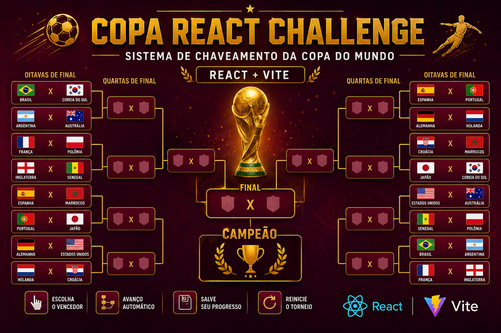

# React + Vite — Sistema de Chaveamento da Copa do Mundo



## Sobre o Projeto

Neste projeto você desenvolverá uma aplicação React capaz de simular um chaveamento completo da Copa do Mundo.

O usuário poderá escolher os vencedores de cada confronto até chegar à grande final e descobrir o campeão.

O objetivo principal é praticar:

- Componentização
- Props
- useState
- useEffect
- Manipulação de Arrays
- Eventos
- Renderização Condicional
- Organização de Projeto React

---

# Estrutura Final Esperada do Projeto

Ao final do desenvolvimento, o projeto deverá possuir uma estrutura semelhante a esta:

```text
src
│
├── components
│   ├── Bracket.jsx
│   ├── Round.jsx
│   ├── Match.jsx
│   ├── TeamCard.jsx
│   └── ChampionScreen.jsx
│
├── data
│   └── teams.js
│
├── styles
│   └── App.css
│
├── App.jsx
└── main.jsx
```

## Função de Cada Arquivo

### src/main.jsx

Responsável por iniciar a aplicação React.

### src/App.jsx

Componente principal.

Controlará:

- Fases do torneio
- Estados da aplicação
- Organização das rodadas

### src/data/teams.js

Armazenará os times participantes.

### src/components/Match.jsx

Representará uma partida.

Exemplo:

```text
Brasil x Coreia do Sul
```

### src/components/Round.jsx

Representará uma rodada completa.

Exemplo:

```text
OITAVAS

Brasil x Coreia
Argentina x Austrália
```

### src/components/Bracket.jsx

Responsável por organizar visualmente todas as fases.

### src/components/ChampionScreen.jsx

Exibirá o campeão.

### src/styles/App.css

Arquivo responsável pelos estilos da aplicação.

---

# Etapa 1 — Criando o Projeto

## Arquivos envolvidos

```text
Nenhum
```

## Objetivo

Criar o projeto React utilizando Vite.

Comandos:

```bash
npm create vite@latest copa-react
cd copa-react
npm install
npm run dev
```

---

# Etapa 2 — Criando os Dados dos Times

## Arquivo

```text
src/data/teams.js
```

Crie o arquivo:

```javascript
export const teams = [
  "Brasil",
  "Argentina",
  "França",
  "Inglaterra",
  "Espanha",
  "Portugal",
  "Alemanha",
  "Holanda",
  "Croácia",
  "Marrocos",
  "Japão",
  "Coreia do Sul",
  "Austrália",
  "Estados Unidos",
  "Senegal",
  "Polônia"
];
```

Objetivo:

Criar uma fonte centralizada de dados.

---

# Etapa 3 — Exibindo os Times

## Arquivo

```text
src/App.jsx
```

Importe os dados:

```javascript
import { teams } from "./data/teams";
```

Exemplo:

```jsx
function App() {
  return (
    <div>
      {teams.map((team) => (
        <p>{team}</p>
      ))}
    </div>
  );
}
```

Objetivo:

Aprender a exibir listas utilizando map().

---

# Etapa 4 — Criando os Confrontos

## Arquivo

```text
src/App.jsx
```

Crie uma estrutura inicial:

```javascript
const oitavas = [
  ["Brasil", "Coreia do Sul"],
  ["Argentina", "Austrália"],
  ["França", "Polônia"],
  ["Inglaterra", "Senegal"]
];
```

Renderize os confrontos.

Exemplo:

```jsx
{
  oitavas.map((partida) => (
    <div>
      {partida[0]} x {partida[1]}
    </div>
  ));
}
```

Objetivo:

Visualizar as partidas antes da componentização.

---

# Etapa 5 — Criando o Componente Match

## Arquivo

```text
src/components/Match.jsx
```

Exemplo inicial:

```jsx
function Match({ teamA, teamB }) {
  return (
    <div>
      <p>{teamA}</p>
      <p>{teamB}</p>
    </div>
  );
}

export default Match;
```

## Arquivo

```text
src/App.jsx
```

Importe o componente:

```javascript
import Match from "./components/Match";
```

Utilize:

```jsx
<Match
  teamA="Brasil"
  teamB="Coreia do Sul"
/>
```

Objetivo:

Criar um componente reutilizável.

---

# Etapa 6 — Escolhendo um Vencedor

## Arquivo

```text
src/components/Match.jsx
```

Importe:

```javascript
import { useState } from "react";
```

Crie um estado:

```javascript
const [winner, setWinner] = useState(null);
```

Exemplo:

```jsx
<button onClick={() => setWinner(teamA)}>
  {teamA}
</button>
```

Objetivo:

Permitir que o usuário escolha o vencedor da partida.

---

# Etapa 7 — Criando uma Rodada

## Arquivo

```text
src/components/Round.jsx
```

Exemplo:

```jsx
import Match from "./Match";

function Round({ title, matches }) {
  return (
    <section>
      <h2>{title}</h2>

      {matches.map((match, index) => (
        <Match
          key={index}
          teamA={match[0]}
          teamB={match[1]}
        />
      ))}
    </section>
  );
}

export default Round;
```

Objetivo:

Agrupar várias partidas.

---

# Etapa 8 — Utilizando Round

## Arquivo

```text
src/App.jsx
```

Importe:

```javascript
import Round from "./components/Round";
```

Utilize:

```jsx
<Round
  title="Oitavas"
  matches={oitavas}
/>
```

Objetivo:

Exibir uma fase completa utilizando componentes.

---

# Etapa 9 — Armazenando os Vencedores

## Arquivo

```text
src/App.jsx
```

Criar estado:

```javascript
const [winners, setWinners] = useState([]);
```

Exemplo:

```javascript
setWinners([
  ...winners,
  "Brasil"
]);
```

Objetivo:

Guardar todos os vencedores da rodada.

---

# Etapa 10 — Gerando as Quartas

## Arquivo

```text
src/App.jsx
```

Exemplo de lógica:

```javascript
for (let i = 0; i < winners.length; i += 2) {
  console.log(
    winners[i],
    winners[i + 1]
  );
}
```

Resultado esperado:

```javascript
[
  ["Brasil", "Argentina"],
  ["França", "Inglaterra"]
]
```

Objetivo:

Transformar vencedores em novos confrontos.

---

# Etapa 11 — Criando o Chaveamento Completo

## Arquivo

```text
src/App.jsx
```

Criar estados para:

```javascript
const [quartas, setQuartas] = useState([]);
const [semifinais, setSemifinais] = useState([]);
const [final, setFinal] = useState([]);
```

Objetivo:

Controlar todas as fases da competição.

---

# Etapa 12 — Exibindo o Campeão

## Arquivo

```text
src/components/ChampionScreen.jsx
```

Exemplo:

```jsx
function ChampionScreen({ champion }) {
  return (
    <h1>
      Campeão: {champion}
    </h1>
  );
}

export default ChampionScreen;
```

## Arquivo

```text
src/App.jsx
```

Importar:

```javascript
import ChampionScreen from "./components/ChampionScreen";
```

Utilizar:

```jsx
{
  champion && (
    <ChampionScreen champion={champion} />
  );
}
```

Objetivo:

Exibir o vencedor final.

---

# Etapa 13 — Estilização

## Arquivo

```text
src/styles/App.css
```

Exemplo:

```css
body {
  background: #4A001F;
  color: white;
}

button {
  cursor: pointer;
}
```

Importação:

## Arquivo

```text
src/App.jsx
```

```javascript
import "./styles/App.css";
```

Objetivo:

Melhorar a aparência da aplicação.

---

# Etapa 14 — Salvando Dados

## Arquivo

```text
src/App.jsx
```

Salvar:

```javascript
localStorage.setItem(
  "champion",
  champion
);
```

Recuperar:

```javascript
localStorage.getItem(
  "champion"
);
```

Objetivo:

Manter os dados mesmo após atualizar a página.

---

# Ordem Recomendada de Desenvolvimento

```text
teams.js
↓
App.jsx
↓
Match.jsx
↓
Round.jsx
↓
Quartas
↓
Semifinais
↓
Final
↓
ChampionScreen.jsx
↓
App.css
↓
LocalStorage
```

Antes de iniciar a próxima etapa, verifique se a etapa atual está funcionando corretamente.
